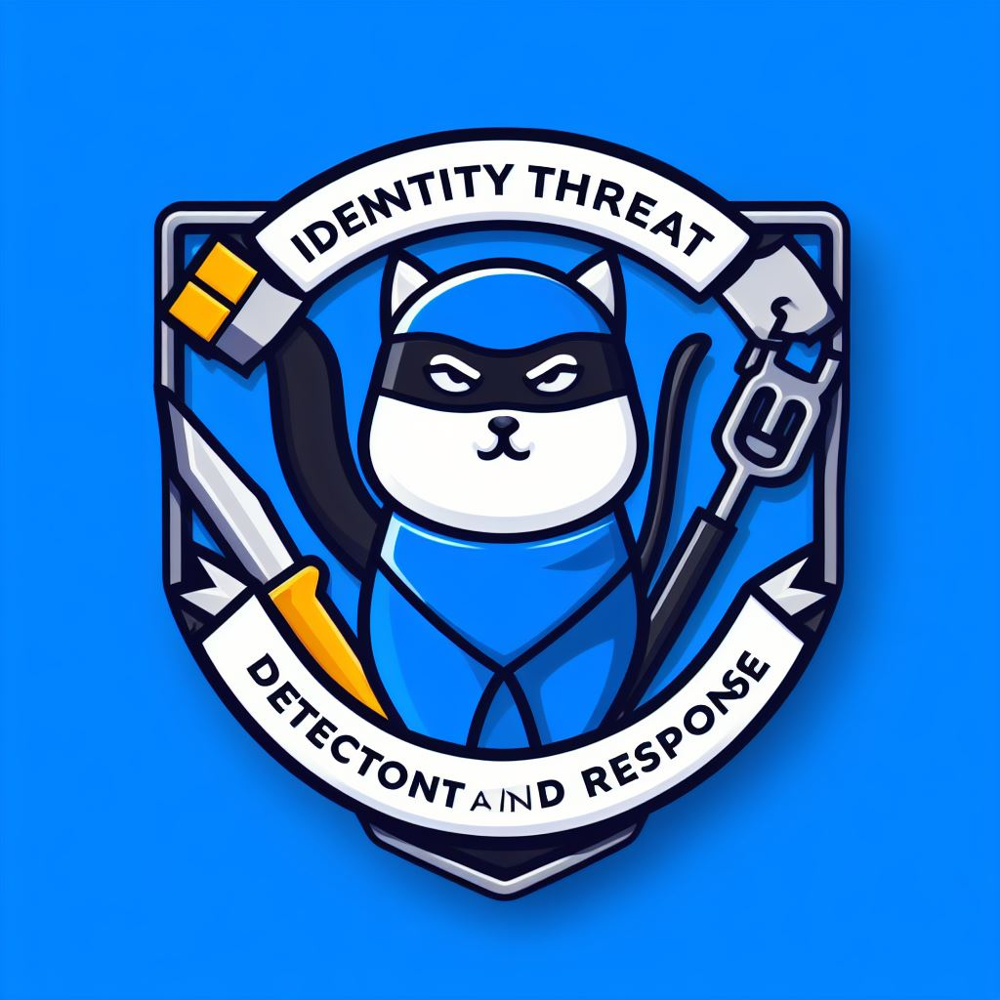

# ITDR - Identity Threat Detection and Response

Collection of Microsoft Identity Threat Detection and Response resources:

- Detection and Hunting Rules
- Playbooks
- Demos and examples for attack techniques
- Other ITDR related stuff around Microsoft Identity related security.

Keep in mind that this is a work in progress and will be updated frequently.

// Kudos to the detection templates: [@falconforceteam](https://twitter.com/falconforceteam) (Twitter) / [FalconForce](https://github.com/falconforceteam) (GitHub).

